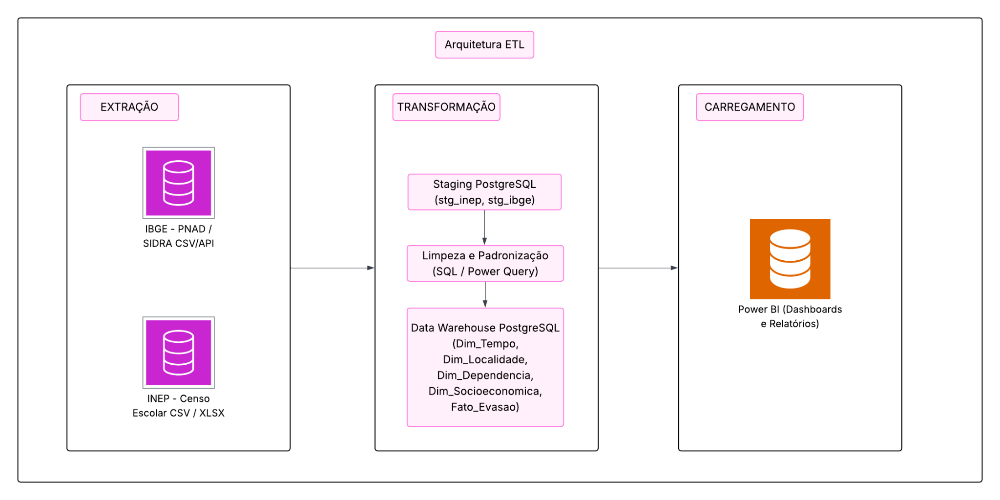
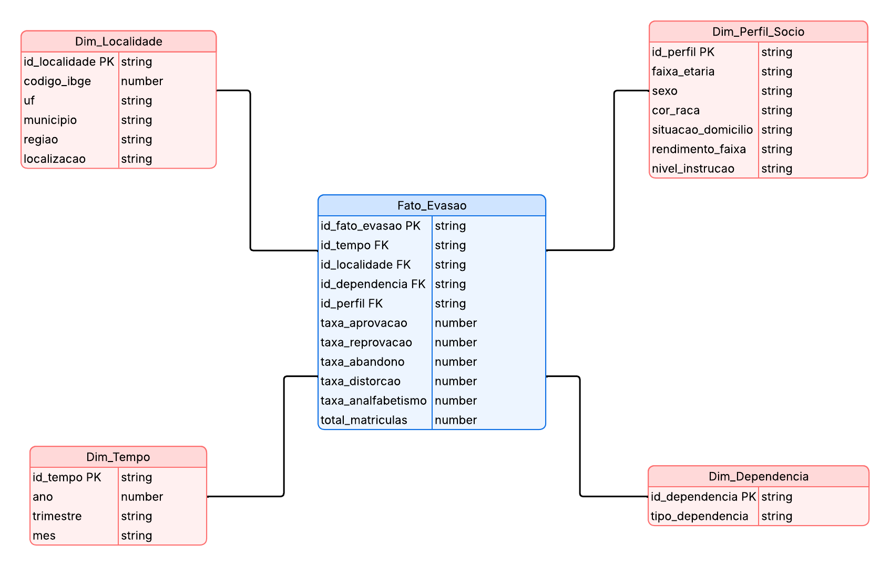

> PONTIFÍCIA UNIVERSIDADE CATÓLICA DE MINAS GERAIS Sistemas de
> informação
>
> Gustavo Aguiar Nogueira Almeida
>
> Miguel Oliveira Bizzi
>
> Raphael Marques
>
> Samuel Leite Diniz
>
> **Análise** **de** **Indicadores** **de** **Evasão** **Escolar**
> **no** **Brasil**
>
> Belo Horizonte 2025

**1.** **INTRODUÇÃO**

A evasão escolar é um dos principais desafios enfrentados pela educação
no Brasil, trazendo consequências significativas para os jovens que a
vivenciam. Entre os principais impactos estão a interrupção do
desenvolvimento humano e social, a dificuldade de inserção no mercado de
trabalho, maior vulnerabilidade a problemas de saúde mental e física,
declínio cognitivo e maior propensão a desenvolver vícios. Além disso, a
evasão escolar compromete o crescimento econômico e o progresso social
do país. Compreender suas causas e identificar padrões é essencial para
a formulação de políticas públicas mais eficazes.

Dessa forma, este trabalho visa analisar dados de evasão escolar,
levando em consideração as taxas de abandono do ensino fundamental e
médio de diferentes regiões, dependências administrativas, níveis de
ensino e suas causas. As principais fontes de dados utilizadas são
relatórios estatísticos sobre a taxa de rendimento escolar no Brasil,
produzidos pelo Instituto Nacional de Estudos e Pesquisas Educacionais
Anísio Teixeira (INEP), que consolida dados do Censo Escolar da Educação
Básica de 2007 a 2024 e do Instituto Brasileiro de Geografia e
Estatística (IBGE), que apresentam indicadores relacionados à taxa de
analfabetismo da população, motivos declarados para a não permanência na
escola e outros aspectos relacionados, de 2016 a 2023.

Assim, será possível identificar os indicadores relacionados à evasão
escolar e criar representações gráficas que auxiliem na interpretação
dos resultados, fornecendo base para ações que visem a permanência dos
estudantes na escola.

**2.** **FONTES**

Instituto Nacional de Estudos e Pesquisas Educacionais Anísio Teixeira
(INEP): Criado em 1937 e vinculado ao Ministério da Educação, o INEP é o
órgão federal responsável por coletar, produzir e disseminar informações
e estatísticas educacionais essenciais para o diagnóstico e melhoria do
sistema de ensino no Brasil. Algumas de suas responsabilidades são a
aplicação de exames nacionais, a realização do Censo Escolar da Educação
Básica e do Censo da Educação Superior, além do apoio à formulação de
políticas públicas para as redes públicas e privadas de ensino.
Portanto, o INEP conduz pesquisas abrangentes e rigorosas para coletar e
processar dados educacionais, gerando informações estatísticas
confiáveis que retratam com fidelidade a realidade do sistema de ensino
brasileiro.

Instituto Brasileiro de Geografia e Estatística (IBGE): Criado em 1934,
o IBGE é o órgão oficial de estatísticas do Brasil. Seu objetivo é
produzir e analisar informações demográficas, sociais, econômicas e
geográficas que servem de base para estudos, diagnósticos e políticas
públicas em diversas áreas. Entre suas principais atividades estão a
realização do Censo Demográfico, da Pesquisa

Nacional por Amostra de Domicílios Contínua (PNAD Contínua) e da Síntese
de Indicadores Sociais, que reúnem dados fundamentais sobre
escolarização, níveis de instrução e fatores relacionados à permanência
ou evasão escolar. Assim, o IBGE fornece estatísticas exatas que
permitem compreender o contexto social mais amplo em que a educação
brasileira está inserida.

**3.** **REQUISITOS** **DE** **INFORMAÇÃO**

Para compreender os fatores que influenciam a evasão escolar, é
necessário levantar um conjunto de informações que permita analisar o
fenômeno em diferentes dimensões. Os principais requisitos de informação
são:

> ● **Taxas** **de** **rendimento** **escolar**: acompanhar indicadores
> de aprovação, reprovação e abandono no ensino fundamental e médio,
> considerando ano de referência, unidade geográfica (Brasil, regiões e
> estados), localização (urbana ou rural), dependência administrativa
> (municipal, estadual, federal e privada) e séries específicas do
> ensino fundamental e médio.
>
> ● **Taxa** **de** **distorção** **idade-série**: analisar a proporção
> de estudantes com atraso escolar em relação à idade recomendada,
> levando em conta ano, região, estado, localização urbana ou rural,
> rede administrativa e etapas do ensino, incluindo detalhamento por
> séries específicas do ensino fundamental e médio.
>
> ● **Principal** **motivo** **para** **ter** **parado** **de**
> **frequentar** **a** **escola**: identificar as razões mais relevantes
> do abandono escolar, segmentadas segundo variáveis sociodemográficas e
> econômicas como situação de atividade, faixa etária, sexo, cor ou
> raça, nível de instrução, condição no domicílio, situação do
> domicílio, classes de rendimento domiciliar per capita e idade em que
> deixou a escola.
>
> ● **Taxa** **de** **analfabetismo** **da** **população**: avaliar a
> proporção de pessoas de 15 anos ou mais que não sabem ler e escrever,
> segundo região geográfica, situação do domicílio , sexo, cor ou raça ,
> grupos de idade e classes de rendimento domiciliar per capita.

Juntos, esses requisitos de informação possibilitam a construção de
indicadores e representações gráficas capazes de revelar padrões e
tendências da evasão escolar no Brasil.

> **4.** **DICIONÁRIO** **DE** **DADOS**

||
||
||
||
||
||
||
||
||
||
||
||
||
||
||

||
||
||
||
||
||
||
||
||
||

> **5.** **ARQUITETURA** **DE** **ETL** **UTILIZANDO** **POWER** **BI**
> **E** **POSTGRESQL**
>
> O processo de ETL (Extração, Transformação e Carga) é fundamental para
> consolidar os indicadores de evasão escolar em um ambiente analítico
> confiável. O Power BI será utilizado para se conectar diretamente a
> diferentes fontes de dados, como planilhas, arquivos CSV e bases
> oficiais do INEP e IBGE, permitindo a integração, limpeza e
> padronização das informações. Por meio do Power Query, serão
> realizados ajustes de formato, unificação de códigos de municípios
> (IBGE)

e normalização de categorias, garantindo a consistência dos dados antes
de sua utilização. Além disso, o Power BI possibilita atualizações
periódicas, assegurando que novos levantamentos anuais sejam
incorporados ao fluxo analítico de maneira ágil.

Após o tratamento, os dados são carregados no PostgreSQL, que atua como
Data Warehouse central, organizado em modelo dimensional para consultas
de alto desempenho. Essa estrutura permite que o Power BI se conecte ao
banco para gerar relatórios dinâmicos e dashboards interativos,
possibilitando análises detalhadas de indicadores como taxa de
rendimento, distorção idade-série, motivos da evasão e taxa de
analfabetismo em diferentes níveis (nacional, estadual e municipal)
apoiando a tomada de decisões estratégicas voltadas à redução da evasão
escolar.

**5.1** **Visão** **Geral** **da** **Arquitetura**

A arquitetura de ETL do projeto segue um fluxo em cinco camadas bem
definidas: Extração, Staging, Transformação, Carga e Apresentação,
garantindo que os dados sobre evasão escolar sejam processados com
consistência e qualidade antes de chegar aos usuários finais.

**Extração:** a primeira etapa concentra-se na coleta de informações
provenientes de duas fontes principais. Do INEP/Censo Escolar são
obtidos arquivos CSV ou XLSX com taxas de aprovação, reprovação,
abandono e distorção idade-série, detalhadas por ano, unidade
federativa, município e rede de ensino. Simultaneamente, a PNAD Contínua
do IBGE fornece microdados e tabelas em CSV ou via API, com indicadores
socioeconômicos como taxa de analfabetismo, rendimento domiciliar e
dados demográficos.

**Staging:** após a coleta, todos os arquivos são carregados em um
ambiente de preparação dentro do PostgreSQL, em tabelas de staging
(stg_inep e stg_ibge). Essa camada atua como zona de recepção
temporária, permitindo auditoria, controle de versões e validação
inicial antes de qualquer alteração nos dados brutos.

**Transformação:** em seguida, ocorre a limpeza e padronização. Formatos
de datas são uniformizados, códigos de municípios e unidades federativas
são unificados por meio do código IBGE, valores nulos são tratados e
categorias como sexo, faixa etária e dependência administrativa são
normalizadas. Nessa fase também são criados indicadores derivados, como
taxas médias por região e faixa etária. A transformação combina
consultas SQL no PostgreSQL e o uso do Power Query no Power BI, que
facilita junções, cálculos e a criação de medidas analíticas, como a
taxa de abandono ponderada por rede de ensino.

**Carga:** depois de tratados, os dados são inseridos no modelo
dimensional do Data Warehouse em PostgreSQL, organizado em tabelas fato
e dimensões. Essa estrutura assegura alto desempenho para consultas e
análises complexas.

**Apresentação:** por fim, o Power BI conecta-se ao Data Warehouse, seja
por DirectQuery ou importação, oferecendo um ambiente de visualização
interativo. Nessa camada, relatórios dinâmicos e dashboards permitem
analisar indicadores como taxa de rendimento, distorção idade-série,
motivos de evasão e taxa de analfabetismo em diferentes níveis de
granularidade — nacional, estadual e municipal — completando o ciclo da
arquitetura.

**5.2** **Extração** **e** **Carga**

> ● **Extração:** automatizada ou semiautomatizada, com downloads de
> arquivos CSV/XLSX e consultas a APIs do IBGE (SIDRA) para séries
> temporais.
>
> ● **Carga:** inserção em tabelas de staging no PostgreSQL, utilizando
> utilitários nativos (COPY, psql) ou scripts Python para grandes
> volumes.

**5.3** **Transformação**

> ● **Power** **Query** **(Power** **BI):** tratamento de
> inconsistências, junção das fontes pelo par **Ano** **+** **Código**
> **IBGE**, criação de indicadores calculados (taxa de abandono por
> rede, por faixa etária, etc.) e agregações temporais (anual,
> semestral).
>
> ● **SQL** **no** **PostgreSQL:** construção de *materialized* *views*
> e agregações para acelerar consultas e permitir análises preditivas.

**5.4** **Armazenamento** **e** **Visualização**

> ● **Armazenamento:** O Data Warehouse é implementado em PostgreSQL,
> estruturado em modelo estrela, com tabelas de dimensão, como Tempo,
> Localidade, Dependência Administrativa e Perfil Socioeconômico e uma
> tabela fato central (Fato_Evasao) que reúne os principais indicadores
> educacionais e socioeconômicos. Essa organização garante alto
> desempenho nas consultas e facilita a análise cruzada entre variáveis
> de educação e contexto social.
>
> ● **Relatórios** **e** **Dashboards:** O Power BI se conecta
> diretamente a essas estruturas, permitindo criar dashboards
> interativos e relatórios dinâmicos

> com filtros por ano, unidade federativa, município, rede de ensino e
> variáveis demográficas. Essa camada de visualização viabiliza análises
> como a correlação entre rendimento domiciliar e taxas de evasão,
> fornecendo insights estratégicos para gestores e pesquisadores.

**6.** **DIAGRAMA** **SIMPLIFICADO** **DA** **ARQUITETURA**

> **Figura** **1** **–** **Arquitetura** **ETL**
>
> ● **Fontes** **de** **Dados:**
>
> ○ Censo Escolar/INEP (indicadores de rendimento e abandono).
>
> ○ IBGE/PNAD (dados socioeconômicos e demográficos).
>
> ● **Processo** **ETL:**
>
> ○ Extração de arquivos CSV e APIs.
>
> ○ Transformação com SQL/Power Query para limpeza, normalização e
> integração das bases.
>
> ○ Carga no modelo dimensional do PostgreSQL.
>
> ● **Apresentação:**
>
> ○ Dashboards interativos no Power BI, permitindo visualização por ano,
> região, rede de ensino e fatores socioeconômicos.

**7** **DESENVOLVIMENTO** **E** **CONSTRUÇÃO** **DA** **SOLUÇÃO** **DE**
**DW**

**7.1** **Modelo** **Dimensional**

O modelo dimensional foi projetado para integrar indicadores
educacionais e socioeconômicos, permitindo análises robustas sobre a
evasão escolar no Brasil. Ele organiza os dados em tabelas fato e
dimensão, garantindo desempenho e consistência nas consultas analíticas.

**7.1.1** **Tabelas** **e** **Relacionamentos**

O modelo é composto por uma tabela fato central, que reúne os principais
indicadores de evasão, e múltiplas tabelas de dimensão, que fornecem
contexto para as análises.

**7.1.1.1** **Tabelas** **Dimensão**

> ● **Dimensão** **Tempo** **(Dim_Tempo)**
>
> ○ Campos:
>
> ■ id_tempo (chave primária)
>
> ■ ano (ex.: 2016–2024)
>
> ■ trimestre
>
> ■ mes
>
> ○ Utilização: Permite análises temporais de longo prazo, como evolução
> anual da taxa de abandono ou comparações por trimestre.
>
> ● **Dimensão** **Localidade** **(Dim_Localidade)**
>
> ○ Campos:
>
> ■ id_localidade (chave primária)
>
> ■ codigo_ibge
>
> ■ uf (sigla da unidade federativa)
>
> ■ municipio
>
> ■ regiao
>
> ■ localizacao (Urbana/Rural)
>
> ○ Utilização: Facilita análises geográficas, permitindo identificar
> padrões regionais e correlações entre evasão e variáveis
> socioeconômicas.
>
> ● **Dimensão** **Dependência** **Administrativa**
> **(Dim_Dependencia)**
>
> ○ Campos:
>
> ■ id_dependencia (chave primária)
>
> ■ tipo_dependencia (Municipal, Estadual, Federal, Privada)
>
> ○ Utilização: Permite analisar taxas de abandono por rede de ensino e
> comparar resultados entre sistemas administrativos.
>
> ● **Dimensão** **Perfil** **Socioeconômico** **(Dim_Perfil_Socio)**
>
> ○ Campos:
>
> ■ id_perfil (chave primária)
>
> ■ faixa_etaria
>
> ■ sexo
>
> ■ cor_raca
>
> ■ situacao_domicilio (Urbano/Rural)
>
> ■ rendimento_faixa (ex.: Até 20%, 21–40% etc.)
>
> ■ nivel_instrucao
>
> ○ Utilização: Possibilita correlações entre evasão escolar e fatores
> sociais, econômicos e demográficos.

**7.1.1.2** **Tabela** **Fato**

> ● **Fato_Evasao**
>
> ○ Campos:
>
> ■ id_fato_evasao (chave primária)
>
> ■ id_tempo (FK Dim_Tempo)
>
> ■ id_localidade (FK Dim_Localidade)
>
> ■ id_dependencia (FK Dim_Dependencia)
>
> ■ id_perfil (FK Dim_Perfil_Socio)
>
> ■ taxa_aprovacao
>
> ■ taxa_reprovacao
>
> ■ taxa_abandono
>
> ■ taxa_distorcao
>
> ■ taxa_analfabetismo
>
> ■ total_matriculas
>
> ○ Utilização: Consolida os indicadores centrais de rendimento escolar
> e variáveis socioeconômicas, permitindo análises como a relação entre
> renda domiciliar e abandono, ou entre cor/raça e distorção
> idade-série.

**7.1.1.3** **Relacionamentos**

Os relacionamentos entre as tabelas são estabelecidos pelas chaves
primárias das dimensões, que se tornam chaves estrangeiras na tabela
fato:

> ● **Fato_Evasao** **↔** **Dim_Tempo**: conecta cada registro a um
> período específico para análises sazonais e anuais.
>
> ● **Fato_Evasao** **↔** **Dim_Localidade**: relaciona indicadores de
> evasão a municípios, UFs e regiões, permitindo análises espaciais
> detalhadas.

> ● **Fato_Evasao** **↔** **Dim_Dependencia**: vincula as taxas a cada
> tipo de rede de ensino, facilitando comparações entre dependências.
>
> ● **Fato_Evasao** **↔** **Dim_Perfil_Socio**: permite cruzar
> informações de evasão com dados de faixa etária, sexo, cor/raça,
> rendimento e nível de instrução.

**7.2** **Diagrama** **do** **Modelo** **Dimensional**

O diagrama do modelo estrela apresenta a Fato_Evasao no centro, ligada a
quatro dimensões: Dim_Tempo, Dim_Localidade, Dim_Dependencia e
Dim_Perfil_Socio, refletindo a integração entre dados educacionais
(INEP) e socioeconômicos (IBGE). Esse desenho garante consultas rápidas
e suporte a dashboards interativos no Power BI, possibilitando insights
estratégicos para políticas de combate à evasão escolar.

> **Figura** **2** **–** **Modelo** **do** **Data** **Warehouse**
